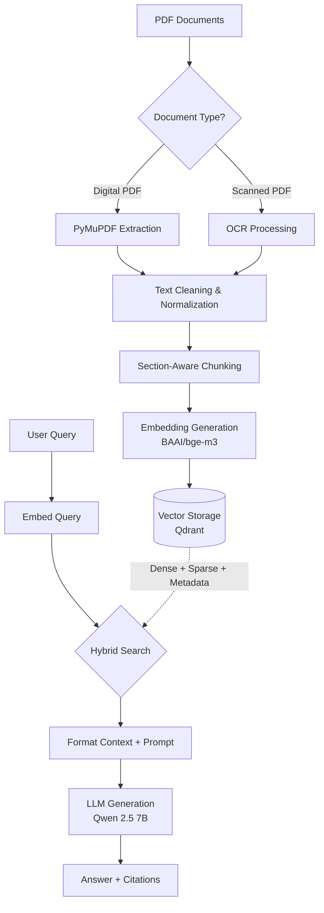
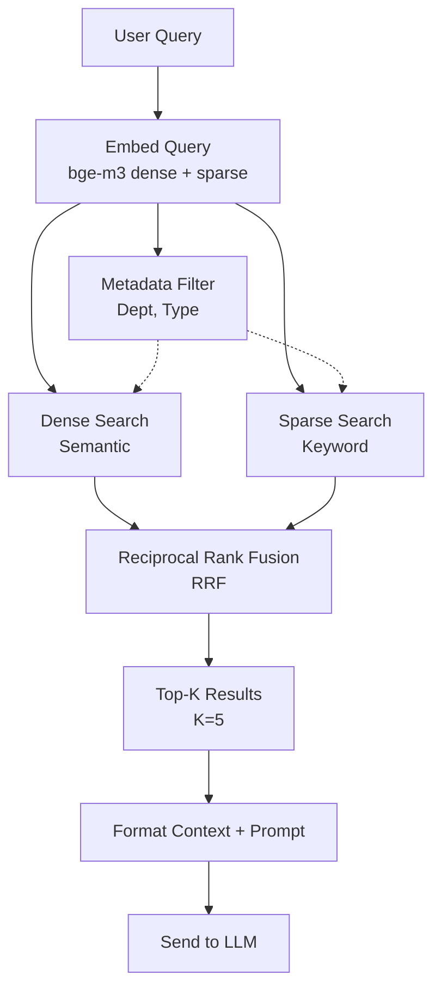

# MAIKMS AI Pipeline Design Document

**Project:** Municipal AI Knowledge Management System (MAIKMS)  
**Client:** SMKC Municipal Corporation  

This is the core design document for the MAIKMS AI pipeline, detailing the complete flow from document ingestion to the final LLM-generated response with citations.

---

## 1. PIPELINE OVERVIEW

The following diagram illustrates the complete flow of the MAIKMS AI pipeline:



---

## 2. PDF TEXT EXTRACTION

### 2.1 Digital PDFs
- **Tool:** PyMuPDF (`fitz`)
- Extract text page-by-page, preserving page numbers.
- Handle multi-column layouts effectively.
- Extract tables as structured text.
- Preserve section numbers and headers for structural integrity.

### 2.2 Scanned PDFs (OCR)
- **Detection:** If average characters per page < 50, classify as scanned.
- **Primary OCR:** Tesseract 5.0 with language packs:
  - `eng` (English)
  - `mar` (Marathi/Devanagari)
- **Fallback OCR:** EasyOCR for enhanced Devanagari script recognition.
- **OCR Preprocessing:**
  - Deskew pages
  - Binarize (adaptive thresholding)
  - Denoise
  - DPI upscaling if needed (target 300 DPI)
- Page-by-page OCR with page number tracking.

#### Current Scanned Documents
| Document | Details | Processing Strategy |
| :--- | :--- | :--- |
| **Maharashtra-Municipal-Laws-Amendment-Act-2026** | 4 pages, scanned, likely English or bilingual | High priority, quick processing using Tesseract (`eng+mar`). |
| **Marathi Full Act** | 538 pages, scanned, Devanagari script | Batch process (50 pages/batch) using EasyOCR. Quality check per batch. Manual review queue for low-confidence pages. Estimated time: ~30-60 mins. |

---

## 3. TEXT CLEANING

Cleaning steps are executed in the following order:

1. **Remove repeated headers/footers:** Detect by comparing the first/last lines across pages.
2. **Remove page numbers:** Strip isolated page numbers from the text body.
3. **Fix broken words:** Repair words split by line breaks (hyphenation).
4. **Normalize Unicode:** Apply NFC normalization, specifically for Devanagari.
5. **Normalize whitespace:** Convert multiple spaces to a single space while preserving paragraph breaks.
6. **Preserve section numbers:** Ensure patterns like "Section 1", "कलम १", etc., remain intact.
7. **Preserve clause numbers:** Keep sub-clauses and numbered items intact.
8. **Remove watermarks/stamps:** Filter out known watermark or stamp text.
9. **Fix common OCR errors:** Apply heuristics to fix frequent OCR misinterpretations in legal text.

---

## 4. SECTION-AWARE CHUNKING STRATEGY

This is **CRITICAL** for legal documents. The chunking must respect the document's inherent structure.

### 4.1 Section Detection Patterns
- **English:** `Section \d+`, `Chapter [IVX]+`, `CHAPTER \d+`, `Schedule [A-Z]`
- **Marathi:** `कलम \d+`, `प्रकरण \d+`, `अनुसूची`
- **Common:** Numbered lists (`1.`, `2.`, `(a)`, `(b)`, `(i)`, `(ii)`)

### 4.2 Chunking Hierarchy
1. Try to split by **CHAPTER** → Each chapter acts as a high-level grouping.
2. Within a chapter, split by **SECTION** → Each section is a primary chunk.
3. If a section exceeds 1000 tokens → Split by sub-section or paragraph.
4. If no structure is detected → Fall back to token-based chunking (512 tokens, 50 token overlap).
5. **Never split mid-sentence.**
6. Each chunk must contain its parent context (e.g., chapter name, section number).

### 4.3 Chunk Metadata Schema
Each chunk stores comprehensive metadata for accurate retrieval and citation:

```json
{
  "document_id": "doc_123",
  "document_title": "Maharashtra Municipal Corporations Act",
  "department": "Legal",
  "document_type": "act",
  "language": "english",
  "chapter": "Chapter II - Constitution",
  "section_number": "Section 5",
  "section_title": "Constitution of Corporation",
  "page_numbers": [12, 13],
  "chunk_index": 15,
  "parent_chunk_id": null,
  "effective_date": "2025-05-02"
}
```

### 4.4 Chunk Size Guidelines
- **Target:** 256-512 tokens per chunk
- **Max:** 1024 tokens
- **Overlap:** 50 tokens between adjacent chunks within the same section
- **Prefixing:** Include the section header as a prefix in every chunk derived from that section.

---

## 5. EMBEDDING STRATEGY

### 5.1 Model Specifications
- **Model:** `BAAI/bge-m3`
- **Dimensions:** 1024
- **Capabilities:** Supports Dense + Sparse + ColBERT embeddings
- **Multilingual Support:** Excellent for English, Hindi, and Marathi
- **Max Tokens:** 8192

### 5.2 Embedding Generation
- **Batch Size:** 32 chunks per batch
- Generate BOTH dense and sparse embeddings to facilitate hybrid search.
- Normalize vectors (L2 normalization).
- Cache embeddings for identical chunks to optimize processing.

### 5.3 Query Embedding
- Prepend the instruction prefix for queries: `"Represent this sentence for searching relevant passages: "`
- Utilize the same `bge-m3` model for query embedding.

---

## 6. VECTOR STORAGE (QDRANT)

### 6.1 Collection Configuration

```text
Collection: maikms_documents
Dense Vector: size=1024, distance=Cosine
Sparse Vector: for BM25-style keyword matching

Payload Indexes:
  - document_id (keyword)
  - department (keyword)
  - document_type (keyword)
  - language (keyword)
  - section_number (keyword)
  - chapter (keyword)
```

### 6.2 Payload Schema
All chunk metadata (defined in Section 4.3) is stored as a Qdrant payload to enable powerful filtering during retrieval.

---

## 7. RETRIEVAL STRATEGY

### 7.1 Hybrid Search Pipeline



### 7.2 Search Parameters
- **Dense Search:** Top 20 candidates
- **Sparse Search:** Top 20 candidates
- **RRF Fusion:** Merge to Top 10
- **Final Selection:** Top 5 chunks after metadata filtering
- **Minimum Score Threshold:** 0.3 (Results below this are treated as "not found")

### 7.3 Metadata Filters
Filters can be optionally applied based on user context or query parameters:
- `department_id`
- `document_type`
- `language`
- `date_range`

---

## 8. LLM CONFIGURATION

### 8.1 Model Settings
- **Model:** `Qwen 2.5 7B` via Ollama
- **Temperature:** 0.1 (low variance for factual responses)
- **Top-p:** 0.9
- **Max Output Tokens:** 2048
- **Context Window:** 8192 tokens
- **Repeat Penalty:** 1.1

### 8.2 System Prompt

```text
You are MAIKMS, the Municipal AI Knowledge Management System for SMKC Municipal Corporation.
You are an expert in Maharashtra municipal law, rules, and procedures.

STRICT RULES:
1. Answer ONLY from the provided CONTEXT documents below.
2. NEVER invent, assume, or fabricate any law, section, rule, or procedure.
3. NEVER guess section numbers or page numbers.
4. ALWAYS cite your sources in the following format after your answer:

📄 Source: [Document Name]
📑 Section: [Section Number]
📃 Page: [Page Number(s)]

5. If the information is NOT in the provided context, respond EXACTLY:
"⚠️ यह जानकारी उपलब्ध आधिकारिक दस्तावेजों में नहीं मिली।
This information was not found in the available official documents.
Please consult the relevant department for further assistance."

6. Support English, Hindi, and Marathi queries.
7. Respond in the SAME LANGUAGE as the user's question.
8. Be precise, professional, and factual.
9. When explaining legal provisions, use simple language.
10. If multiple sections are relevant, cite ALL of them.
```

### 8.3 Context Format

```text
--- CONTEXT DOCUMENTS ---

[Document 1]
Source: {document_title}
Section: {section_number} - {section_title}
Page: {page_numbers}
Content:
{chunk_text}

[Document 2]
...

--- END CONTEXT ---

User Question: {user_query}
```

---

## 9. ANSWER QUALITY SAFEGUARDS

### 9.1 Confidence Scoring
- **HIGH (score > 0.7):** Strong match; answer directly.
- **MEDIUM (0.5 - 0.7):** Answer with caveat *"Based on available documents..."*.
- **LOW (0.3 - 0.5):** Suggest the user verify the information with the relevant department.
- **NONE (< 0.3):** Return standard "not found" response.

### 9.2 Citation Validation
- Parse the LLM's response for cited section numbers.
- Verify that the cited sections actually exist in the retrieved context chunks.
- Flag or suppress the response if the LLM cites sections not present in the provided context.

### 9.3 Prompt Injection Protection
- **Detect Patterns:** Block inputs containing phrases like *"ignore previous"*, *"forget instructions"*, or *"you are now"*.
- **Action:** Block and log suspicious prompts.
- **Security:** Implement rate limiting per user.

---

## 10. MULTI-TURN CONVERSATION
- **Sliding Window:** Retain the last 5 user-assistant exchanges.
- **Context Continuity:** Include the conversation history in the prompt to handle follow-up questions.
- **Topic Tracking:** Monitor topic shifts and reset the context window if the topic changes significantly.

---

## 11. EVALUATION METRICS
To ensure continuous improvement, the pipeline is evaluated on the following metrics:
1. **Retrieval Accuracy:** Percentage of relevant chunks appearing in the Top-5 results.
2. **Answer Groundedness:** Percentage of answers fully supported by the retrieved context.
3. **Citation Accuracy:** Percentage of correctly formatted and accurate citations.
4. **Response Time:** Target end-to-end latency of < 15s on CPU architecture.
5. **User Satisfaction:** Measured via user feedback ratio (thumbs up/down).
