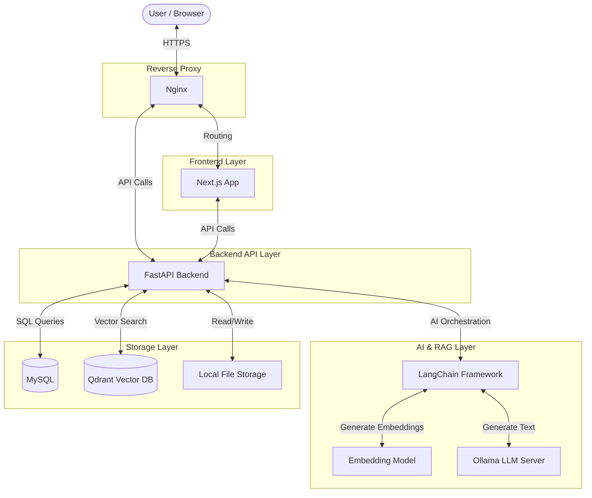
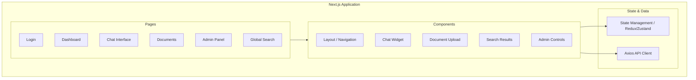
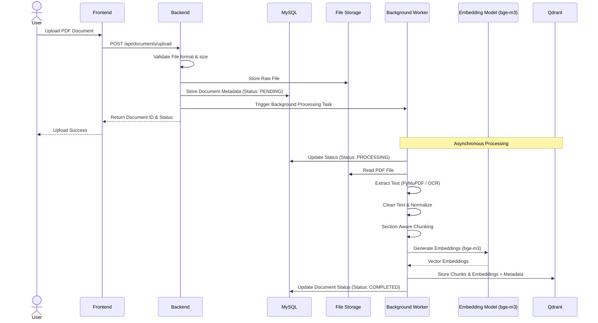
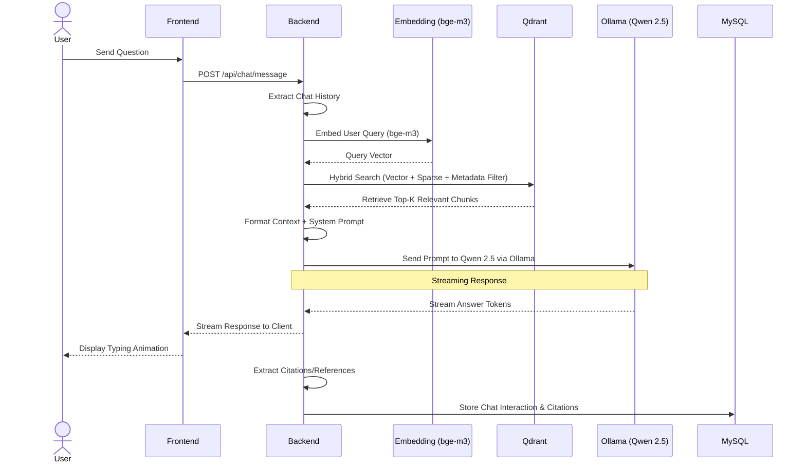
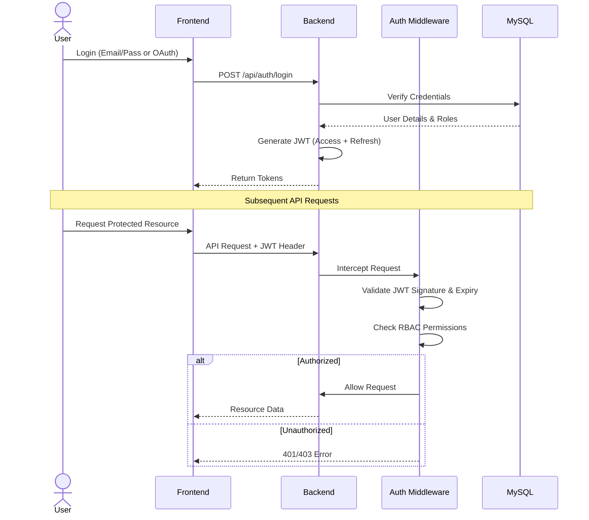
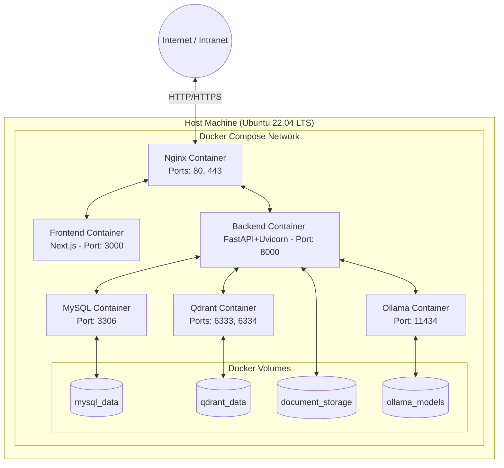

# Municipal AI Knowledge Management System (MAIKMS)
## System Architecture Document

**Client:** SMKC Municipal Corporation

---

## 1. SYSTEM OVERVIEW

The Municipal AI Knowledge Management System (MAIKMS) is an enterprise-grade, RAG-based (Retrieval-Augmented Generation) AI Knowledge Management System designed specifically for the SMKC Municipal Corporation.

**Key Features:**
*   **Enterprise RAG:** Leverages internal documents to provide accurate, context-aware answers.
*   **Local Deployment:** Zero cloud AI dependency. All data, embeddings, and LLM inference run locally to ensure absolute data privacy and security.
*   **Multilingual Support:** Fully supports operations and querying in English, Hindi, and Marathi.

---

## 2. HIGH-LEVEL ARCHITECTURE

The system follows a modern decoupled architecture with a frontend SPA, a backend API layer, an AI/RAG processing engine, and dedicated storage layers for relational and vector data.



---

## 3. COMPONENT DIAGRAM

The architecture is modular, separating concerns across routing, business logic, AI operations, and data access.

### Backend Components

```mermaid
graph TD
    subgraph "FastAPI Application"
        subgraph "API Router Layer"
            AuthRouter[Auth]
            UsersRouter[Users]
            DocsRouter[Documents]
            ChatRouter[Chat]
            SearchRouter[Search]
            AdminRouter[Admin]
        end
        
        subgraph "Middleware Layer"
            AuthMid[Auth & RBAC]
            RateLimiting[Rate Limiting]
            Logging[Logging]
            ErrorHand[Error Handling]
        end

        subgraph "Service Layer"
            AuthSvc[auth_service]
            DocSvc[document_service]
            ProcessSvc[processing_service]
            ChatSvc[chat_service]
            SearchSvc[search_service]
        end

        subgraph "AI Layer"
            RAGEngine[rag_engine]
            EmbedSvc[embedding_service]
            LLMSvc[llm_service]
            RetrieveSvc[retrieval_service]
        end

        subgraph "Data Layer"
            MySQLRepo[MySQL Repositories]
            QdrantClient[Qdrant Client]
            FSClient[File Storage Manager]
        end
    end
    
    API Router Layer --> Middleware Layer
    Middleware Layer --> Service Layer
    Service Layer --> AI Layer
    Service Layer --> Data Layer
    AI Layer --> Data Layer
```

### Frontend Components



---

## 4. DATA FLOW DIAGRAMS

### 4.1 Document Upload & Processing Flow



### 4.2 AI Chat (RAG) Flow



### 4.3 Authentication Flow



---

## 5. DEPLOYMENT ARCHITECTURE

The deployment leverages Docker Compose for isolated, reproducible environments across all services.



---

## 6. TECHNOLOGY STACK

| Layer | Technology | Version | Purpose |
| :--- | :--- | :--- | :--- |
| **Frontend** | Next.js | 14+ | React framework for UI |
| | React | 18+ | UI library |
| | Tailwind CSS | 3.4+ | Utility-first styling |
| **Backend** | Python | 3.11+ | Core language |
| | FastAPI | 0.110+ | High-performance web framework |
| | SQLAlchemy | 2.0+ | ORM for MySQL |
| | Alembic | Latest | Database migrations |
| | Uvicorn | Latest | ASGI Web Server |
| **Databases** | MySQL | 8.0+ | Relational data (Users, Metadata, Chat history) |
| | Qdrant | 1.8+ | Vector database for embeddings |
| **AI / ML** | Ollama | 0.3+ | Local LLM hosting |
| | Qwen 2.5 7B | 7B | Base LLM model |
| | BAAI/bge-m3 | Latest | Multilingual embeddings (1024 dims) |
| | LangChain | 0.2+ | LLM orchestration framework |
| **Document Processing**| PyMuPDF | 1.24+ | Fast PDF text extraction |
| | pdfplumber | Latest | Complex layout PDF extraction |
| | Tesseract / EasyOCR | 5.0+ / Latest | OCR for scanned documents |
| **Security** | python-jose | Latest | JWT creation and verification |
| | passlib (bcrypt) | Latest | Password hashing |
| **Infrastructure** | Docker & Compose | Latest | Containerization |
| | Nginx | Latest | Reverse proxy & static file server |
| | Ubuntu | 22.04 LTS | Production operating system |

---

## 7. SECURITY ARCHITECTURE

Security is a primary focus for MAIKMS, especially given the handling of municipal data.

*   **Authentication & Authorization:**
    *   JWT-based authentication (Access & Refresh tokens).
    *   Robust Role-Based Access Control (RBAC) middleware enforcing permissions (e.g., Admin vs. Standard User vs. Read-Only).
*   **Transport Security:**
    *   HTTPS/TLS encryption for all client-server communication.
*   **API Security:**
    *   Rate limiting implemented on critical endpoints to prevent abuse.
    *   Strict CORS (Cross-Origin Resource Sharing) policy.
    *   Input validation and sanitization using Pydantic schemas.
*   **Data Security:**
    *   SQL injection protection enforced via SQLAlchemy parameterized queries and ORM models.
    *   XSS (Cross-Site Scripting) protection headers enforced at the Nginx and FastAPI layers.
    *   Strict file upload validation (MIME type, size, extension) to prevent malicious payloads.
*   **AI Security:**
    *   Prompt injection detection to prevent malicious manipulation of the LLM.
*   **Auditing:**
    *   Comprehensive audit logging for document access, modifications, and system configurations.

---

## 8. SCALABILITY CONSIDERATIONS

While deployed locally, the architecture is designed to scale as usage grows.

*   **Horizontal Scaling:** The FastAPI backend is stateless, allowing multiple worker processes to run concurrently via Gunicorn/Uvicorn to handle higher API load.
*   **Vertical Scaling (AI):** The Ollama service will benefit significantly from GPU acceleration (NVIDIA CUDA). Allocating more VRAM directly improves token generation speed and concurrency.
*   **Caching Strategy:**
    *   **Response Caching:** Optional Redis integration to cache frequent API responses.
    *   **Embedding Cache:** Implementing an embedding cache to avoid re-embedding identical user queries.
*   **Database Optimization:**
    *   SQLAlchemy connection pooling to manage concurrent MySQL connections efficiently.
    *   Appropriate indexing on MySQL tables and Qdrant collections.
