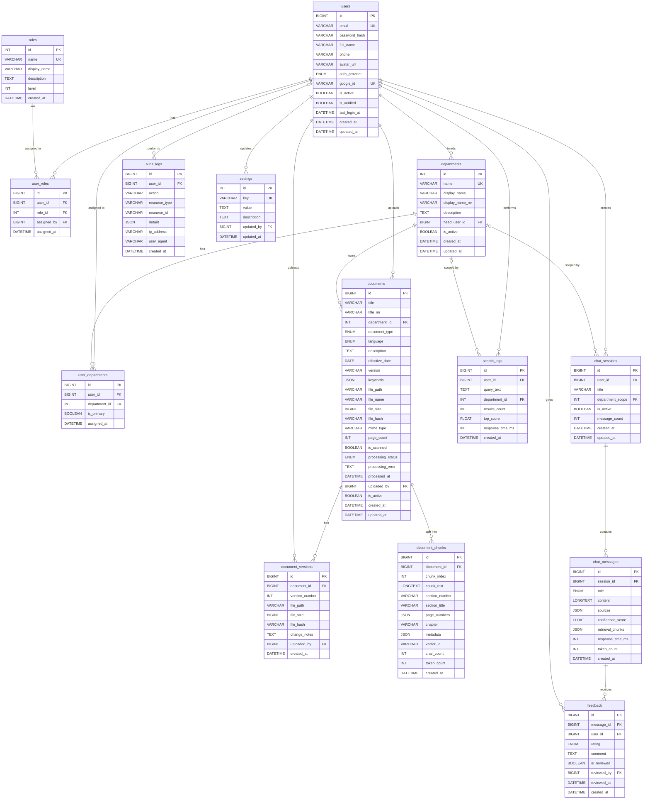

# MAIKMS Database Schema Document

**Project:** Municipal AI Knowledge Management System (MAIKMS)
**Client:** SMKC Municipal Corporation
**Database:** MySQL 8.0 with SQLAlchemy ORM

---

## 1. ER Diagram



## 2. Complete Table Definitions

### a) `users`
Stores user account information and authentication details.

| Column | Data Type | Constraints | Description |
| :--- | :--- | :--- | :--- |
| `id` | BIGINT | PK, AUTO_INCREMENT | Unique identifier for the user |
| `email` | VARCHAR(255) | UNIQUE, NOT NULL | User's email address (login identifier) |
| `password_hash` | VARCHAR(255) | Nullable | Hashed password (null for OAuth-only users) |
| `full_name` | VARCHAR(255) | NOT NULL | User's full name |
| `phone` | VARCHAR(20) | Nullable | User's phone number |
| `avatar_url` | VARCHAR(500) | Nullable | URL to user's avatar image |
| `auth_provider` | ENUM | `'local'`, `'google'` | Authentication method used |
| `google_id` | VARCHAR(255) | UNIQUE, Nullable | Google OAuth ID |
| `is_active` | BOOLEAN | Default `true` | Whether the account is active/enabled |
| `is_verified` | BOOLEAN | Default `false` | Whether the email address is verified |
| `last_login_at` | DATETIME | Nullable | Timestamp of last successful login |
| `created_at` | DATETIME | NOT NULL, Default `CURRENT_TIMESTAMP` | Record creation timestamp |
| `updated_at` | DATETIME | NOT NULL, On update `CURRENT_TIMESTAMP` | Record last update timestamp |

### b) `roles`
System roles defining access levels and permissions.

| Column | Data Type | Constraints | Description |
| :--- | :--- | :--- | :--- |
| `id` | INT | PK, AUTO_INCREMENT | Unique identifier for the role |
| `name` | VARCHAR(50) | UNIQUE | System name (e.g., super_admin, commissioner, etc.) |
| `display_name` | VARCHAR(100) | | Human-readable role name |
| `description` | TEXT | | Detailed description of role privileges |
| `level` | INT | | Hierarchy level (1 = highest) |
| `created_at` | DATETIME | | Record creation timestamp |

### c) `user_roles`
Mapping table linking users to their assigned roles.

| Column | Data Type | Constraints | Description |
| :--- | :--- | :--- | :--- |
| `id` | BIGINT | PK | Unique mapping identifier |
| `user_id` | BIGINT | FK (users) | Reference to the user |
| `role_id` | INT | FK (roles) | Reference to the assigned role |
| `assigned_by` | BIGINT | FK (users), Nullable | User who assigned this role |
| `assigned_at` | DATETIME | | Timestamp when role was assigned |

*Note: Contains UNIQUE constraint on (`user_id`, `role_id`).*

### d) `departments`
Municipal departments structure.

| Column | Data Type | Constraints | Description |
| :--- | :--- | :--- | :--- |
| `id` | INT | PK, AUTO_INCREMENT | Unique identifier for the department |
| `name` | VARCHAR(100) | UNIQUE | System name for the department |
| `display_name` | VARCHAR(200) | | Human-readable English name |
| `display_name_mr` | VARCHAR(200) | | Marathi translation of the name |
| `description` | TEXT | | Description of the department's function |
| `head_user_id` | BIGINT | FK (users), Nullable | User ID of the department head |
| `is_active` | BOOLEAN | Default `true` | Whether the department is currently active |
| `created_at` | DATETIME | | Record creation timestamp |
| `updated_at` | DATETIME | | Record last update timestamp |

### e) `user_departments`
Mapping table for users associated with one or more departments.

| Column | Data Type | Constraints | Description |
| :--- | :--- | :--- | :--- |
| `id` | BIGINT | PK | Unique mapping identifier |
| `user_id` | BIGINT | FK (users) | Reference to the user |
| `department_id` | INT | FK (departments) | Reference to the department |
| `is_primary` | BOOLEAN | Default `false` | Whether this is the user's primary department |
| `assigned_at` | DATETIME | | Timestamp of assignment |

### f) `documents`
Core knowledgebase documents metadata and file references.

| Column | Data Type | Constraints | Description |
| :--- | :--- | :--- | :--- |
| `id` | BIGINT | PK, AUTO_INCREMENT | Unique document identifier |
| `title` | VARCHAR(500) | NOT NULL | Document title in English |
| `title_mr` | VARCHAR(500) | Nullable | Document title in Marathi |
| `department_id` | INT | FK (departments) | Department owning this document |
| `document_type` | ENUM | | Type (act, gr, circular, sop, manual, bylaw, rule, faq, amendment, schedule) |
| `language` | ENUM | | Document language (english, hindi, marathi, bilingual) |
| `description` | TEXT | | Detailed document description/summary |
| `effective_date` | DATE | Nullable | Date document comes into effect |
| `version` | VARCHAR(50) | | Current version string |
| `keywords` | JSON | | Array of search keywords |
| `file_path` | VARCHAR(1000) | NOT NULL | Storage path to the physical file |
| `file_name` | VARCHAR(500) | NOT NULL | Original uploaded filename |
| `file_size` | BIGINT | | File size in bytes |
| `file_hash` | VARCHAR(64) | | SHA256 hash for deduplication |
| `mime_type` | VARCHAR(100) | | File MIME type |
| `page_count` | INT | | Number of pages |
| `is_scanned` | BOOLEAN | Default `false` | True if document is a scanned image/PDF requiring OCR |
| `processing_status` | ENUM | | Current pipeline state (pending, processing, completed, failed, reprocessing) |
| `processing_error` | TEXT | Nullable | Error details if processing failed |
| `processed_at` | DATETIME | Nullable | Timestamp when pipeline finished |
| `uploaded_by` | BIGINT | FK (users) | User who uploaded the document |
| `is_active` | BOOLEAN | Default `true` | Logical deletion flag |
| `created_at` | DATETIME | | Upload timestamp |
| `updated_at` | DATETIME | | Last modification timestamp |

### g) `document_versions`
History of document file revisions.

| Column | Data Type | Constraints | Description |
| :--- | :--- | :--- | :--- |
| `id` | BIGINT | PK | Unique version identifier |
| `document_id` | BIGINT | FK (documents) | Reference to main document |
| `version_number` | INT | | Sequential version number |
| `file_path` | VARCHAR(1000) | | Storage path for this version |
| `file_size` | BIGINT | | File size in bytes |
| `file_hash` | VARCHAR(64) | | SHA256 hash of this version |
| `change_notes` | TEXT | | Notes describing the change |
| `uploaded_by` | BIGINT | FK (users) | User who uploaded this version |
| `created_at` | DATETIME | | Upload timestamp |

### h) `document_chunks`
Text segments parsed from documents for vector similarity search.

| Column | Data Type | Constraints | Description |
| :--- | :--- | :--- | :--- |
| `id` | BIGINT | PK, AUTO_INCREMENT | Unique chunk identifier |
| `document_id` | BIGINT | FK (documents) | Reference to parent document |
| `chunk_index` | INT | NOT NULL | Sequential order within document |
| `chunk_text` | LONGTEXT | NOT NULL | The actual text content |
| `section_number` | VARCHAR(100) | Nullable | Document section/article number |
| `section_title` | VARCHAR(500) | Nullable | Document section title |
| `page_numbers` | JSON | | Array of pages spanning this chunk |
| `chapter` | VARCHAR(200) | Nullable | Chapter name if applicable |
| `metadata` | JSON | | Extra unstructured context |
| `vector_id` | VARCHAR(255) | | Corresponding ID in vector DB (e.g., Qdrant) |
| `char_count` | INT | | Number of characters |
| `token_count` | INT | Nullable | Number of LLM tokens |
| `created_at` | DATETIME | | Record creation timestamp |

### i) `chat_sessions`
User AI chat conversational threads.

| Column | Data Type | Constraints | Description |
| :--- | :--- | :--- | :--- |
| `id` | BIGINT | PK, AUTO_INCREMENT | Unique session identifier |
| `user_id` | BIGINT | FK (users) | Owner of this session |
| `title` | VARCHAR(500) | | Auto-generated title based on initial prompt |
| `department_scope` | INT | FK (departments), Nullable | Filter context (null = all departments) |
| `is_active` | BOOLEAN | Default `true` | Logical deletion/archival flag |
| `message_count` | INT | Default `0` | Number of messages in thread |
| `created_at` | DATETIME | | Session start timestamp |
| `updated_at` | DATETIME | | Last activity timestamp |

### j) `chat_messages`
Individual messages within an AI chat session.

| Column | Data Type | Constraints | Description |
| :--- | :--- | :--- | :--- |
| `id` | BIGINT | PK, AUTO_INCREMENT | Unique message identifier |
| `session_id` | BIGINT | FK (chat_sessions) | Reference to parent session |
| `role` | ENUM | | Message sender (user, assistant, system) |
| `content` | LONGTEXT | NOT NULL | Message text |
| `sources` | JSON | Nullable | Array of {document_id, document_name, section, page} |
| `confidence_score` | FLOAT | Nullable | RAG relevance confidence metric |
| `retrieval_chunks` | JSON | Nullable | Array of document_chunks IDs retrieved |
| `response_time_ms` | INT | Nullable | Generation time in ms |
| `token_count` | INT | Nullable | Total tokens consumed |
| `created_at` | DATETIME | | Message timestamp |

### k) `feedback`
User feedback on specific AI responses.

| Column | Data Type | Constraints | Description |
| :--- | :--- | :--- | :--- |
| `id` | BIGINT | PK, AUTO_INCREMENT | Unique feedback identifier |
| `message_id` | BIGINT | FK (chat_messages) | Reference to the evaluated message |
| `user_id` | BIGINT | FK (users) | User giving feedback |
| `rating` | ENUM | | Evaluation (positive, negative) |
| `comment` | TEXT | Nullable | Optional text explanation |
| `is_reviewed` | BOOLEAN | Default `false` | Whether admins have reviewed this |
| `reviewed_by` | BIGINT | FK (users), Nullable | Admin who reviewed it |
| `reviewed_at` | DATETIME | Nullable | Timestamp of review |
| `created_at` | DATETIME | | Feedback timestamp |

### l) `audit_logs`
System-wide audit trail for critical actions.

| Column | Data Type | Constraints | Description |
| :--- | :--- | :--- | :--- |
| `id` | BIGINT | PK, AUTO_INCREMENT | Unique log entry identifier |
| `user_id` | BIGINT | FK (users), Nullable | User performing the action |
| `action` | VARCHAR(100) | NOT NULL | Action key (e.g., login, upload, query) |
| `resource_type` | VARCHAR(100) | | Affected resource type |
| `resource_id` | VARCHAR(100) | Nullable | Affected resource ID |
| `details` | JSON | Nullable | Additional event context/payload |
| `ip_address` | VARCHAR(45) | | Origin IP |
| `user_agent` | VARCHAR(500) | | Client browser/app agent |
| `created_at` | DATETIME | | Event timestamp |

### m) `search_logs`
Telemetry for global RAG search queries.

| Column | Data Type | Constraints | Description |
| :--- | :--- | :--- | :--- |
| `id` | BIGINT | PK, AUTO_INCREMENT | Unique search event identifier |
| `user_id` | BIGINT | FK (users) | User performing the search |
| `query_text` | TEXT | NOT NULL | Raw search text |
| `department_id` | INT | FK (departments), Nullable | Department filter applied (if any) |
| `results_count` | INT | | Number of results retrieved |
| `top_score` | FLOAT | Nullable | Similarity score of best match |
| `response_time_ms`| INT | | Total retrieval/generation time |
| `created_at` | DATETIME | | Search timestamp |

### n) `settings`
Global application configuration.

| Column | Data Type | Constraints | Description |
| :--- | :--- | :--- | :--- |
| `id` | INT | PK, AUTO_INCREMENT | Unique setting identifier |
| `key` | VARCHAR(100) | UNIQUE, NOT NULL | Setting key name |
| `value` | TEXT | | Setting value |
| `description` | TEXT | | Purpose of the setting |
| `updated_by` | BIGINT | FK (users), Nullable | User who last updated this |
| `updated_at` | DATETIME | | Timestamp of last update |

---

## 3. Indexes

To ensure optimal query performance, the following indexes are required:

```sql
-- Users & Roles
CREATE INDEX idx_users_email ON users(email);
CREATE INDEX idx_users_google_id ON users(google_id);
CREATE UNIQUE INDEX idx_user_roles_unique ON user_roles(user_id, role_id);

-- Documents
CREATE INDEX idx_docs_department ON documents(department_id);
CREATE INDEX idx_docs_type ON documents(document_type);
CREATE INDEX idx_docs_status ON documents(processing_status);
CREATE INDEX idx_docs_hash ON documents(file_hash);

-- Document Chunks (Crucial for filtering before vector search)
CREATE INDEX idx_chunks_document ON document_chunks(document_id);
CREATE INDEX idx_chunks_vector ON document_chunks(vector_id);

-- Chat System
CREATE INDEX idx_chat_user ON chat_sessions(user_id);
CREATE INDEX idx_chat_dept ON chat_sessions(department_scope);
CREATE INDEX idx_messages_session ON chat_messages(session_id);

-- Telemetry & Audit
CREATE INDEX idx_audit_user_action ON audit_logs(user_id, action);
CREATE INDEX idx_audit_resource ON audit_logs(resource_type, resource_id);
CREATE INDEX idx_search_user ON search_logs(user_id);
```

---

## 4. Seed Data

### Roles
```sql
INSERT INTO roles (name, display_name, description, level, created_at) VALUES 
('super_admin', 'Super Administrator', 'Full system access', 1, NOW()),
('commissioner', 'Commissioner', 'Executive access across all departments', 2, NOW()),
('dept_admin', 'Department Admin', 'Manage department specific resources', 3, NOW()),
('officer', 'Municipal Officer', 'Standard internal user', 4, NOW()),
('clerk', 'Clerk', 'Data entry and upload staff', 5, NOW()),
('citizen', 'Citizen', 'Public access level', 6, NOW());
```

### Departments
```sql
INSERT INTO departments (name, display_name, display_name_mr, description, is_active, created_at) VALUES 
('admin', 'Administration', 'प्रशासन', 'General Municipal Administration', 1, NOW()),
('health', 'Public Health', 'सार्वजनिक आरोग्य', 'Health and Sanitation', 1, NOW()),
('water', 'Water Supply', 'पाणी पुरवठा', 'Water Management and Distribution', 1, NOW()),
('pwd', 'Public Works', 'सार्वजनिक बांधकाम', 'Infrastructure and Roads', 1, NOW()),
('tax', 'Property Tax', 'मालमत्ता कर', 'Taxation and Revenue', 1, NOW()),
('town_planning', 'Town Planning', 'नगर रचना', 'Urban Development', 1, NOW()),
('fire', 'Fire Brigade', 'अग्निशमन दल', 'Emergency Fire Services', 1, NOW()),
('education', 'Education', 'शिक्षण', 'Municipal Schools', 1, NOW()),
('solid_waste', 'Solid Waste Management', 'घनकचरा व्यवस्थापन', 'Garbage and Waste Management', 1, NOW()),
('electrical', 'Electrical', 'विद्युत', 'Street Lighting and Power', 1, NOW()),
('garden', 'Parks & Gardens', 'उद्यान', 'Maintenance of Public Parks', 1, NOW()),
('estate', 'Estate Management', 'मालमत्ता व्यवस्थापन', 'Municipal Properties', 1, NOW()),
('license', 'License', 'परवाना', 'Trade and Business Licenses', 1, NOW()),
('vehicle', 'Vehicle Depot', 'वाहन विभाग', 'Municipal Fleet Management', 1, NOW()),
('audit', 'Audit', 'लेखापरीक्षण', 'Financial Auditing', 1, NOW()),
('welfare', 'Social Welfare', 'समाजकल्याण', 'Community Welfare Programs', 1, NOW());
```

### Super Admin User
```sql
INSERT INTO users (email, full_name, auth_provider, is_active, is_verified, created_at) 
VALUES ('admin@smkc.gov.in', 'System Administrator', 'local', 1, 1, NOW());

-- Assuming the user ID is 1 and super_admin role ID is 1
INSERT INTO user_roles (user_id, role_id, assigned_at) 
VALUES (1, 1, NOW());
```

### Settings
```sql
INSERT INTO settings (`key`, value, description, updated_at) VALUES 
('system_name', 'SMKC MAIKMS', 'System display name', NOW()),
('max_upload_size_mb', '50', 'Maximum document upload size in MB', NOW()),
('allowed_mime_types', '["application/pdf", "image/jpeg", "image/png"]', 'Allowed file types for upload', NOW()),
('rag_chunk_size', '1000', 'Vector chunk size in characters', NOW()),
('rag_chunk_overlap', '200', 'Vector chunk overlap in characters', NOW());
```

---

## 5. Migration Notes

### Alembic Migration Strategy
- Use `alembic` (Python) coupled with SQLAlchemy to handle incremental schema migrations.
- **Initial Setup:** Run `alembic init alembic` to create the migration environment.
- **Autogenerate:** Use `alembic revision --autogenerate -m "Initial schema"` to bootstrap migrations directly from SQLAlchemy declarative base models.
- **Upgrades/Downgrades:** Ensure all migrations possess an explicit `upgrade()` and `downgrade()` path for rollback safety.

### Version Control Approach
- All database schemas (SQLAlchemy models) and Alembic migration scripts must be committed to the Git repository.
- Avoid manual schema modifications; all changes must pass through an alembic revision.
- Database seeds (like the ones above) should be handled either via a dedicated `seeds.py` script or injected as part of the initial data migration.
