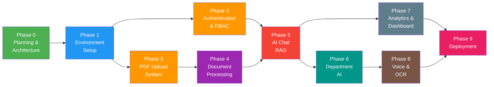

# MAIKMS — Implementation Plan & Roadmap

## Project Overview

**Project**: Municipal AI Knowledge Management System (MAIKMS)  
**Type**: Enterprise RAG-based AI Knowledge Management System  
**Target Users**: Municipal Corporation officers, staff, and citizens  
**Cost**: ₹0 during development (all free/open-source tools)  
**Deployment**: Fully local — no cloud AI dependency  

---

## 🗺️ Phase Dependency Map



> [!NOTE]
> Phase 2 (Auth) and Phase 3 (PDF Upload) can run **in parallel** after Phase 1 is complete.

---

## 📐 Development Principles

| Principle | Description |
|---|---|
| **SDLC-First** | No coding without design. Every phase starts with design, then implementation. |
| **Modular** | Each component is independent and replaceable |
| **Enterprise-Grade** | Clean code, proper error handling, logging, audit trails |
| **Document-Grounded** | AI answers come ONLY from official documents — zero hallucination tolerance |
| **Free & Open Source** | No paid APIs, no vendor lock-in during development |
| **Local-First** | Everything runs on a local/on-premise server |
| **Multilingual-Ready** | English, Hindi, Marathi support from Day 1 |

---

---

# Phase 0 — Planning & Architecture

> **Goal**: Lock down every design decision BEFORE writing code.

## 0.1 — Requirements Document

- [ ] Finalize all functional requirements
- [ ] Finalize all non-functional requirements (performance, security, scalability)
- [ ] Define user stories per role (Super Admin, Commissioner, Officer, Clerk, Citizen)
- [ ] Define document types and their metadata schemas
- [ ] Define AI behavior rules (grounding, citation format, fallback responses)

**Output**: `docs/requirements.md`

## 0.2 — System Architecture

- [ ] High-level architecture diagram (frontend ↔ backend ↔ AI ↔ storage)
- [ ] Component diagram (each service and its responsibility)
- [ ] Data flow diagram (PDF upload → processing → embedding → retrieval → answer)
- [ ] Deployment architecture (Docker services, networking, volumes)
- [ ] Technology stack finalization with version numbers

**Output**: `docs/architecture.md`

## 0.3 — Database Design

- [ ] Entity-Relationship (ER) diagram
- [ ] MySQL schema — all tables with columns, types, constraints, indexes
- [ ] Tables needed:
  - `users` — user accounts
  - `roles` — role definitions
  - `user_roles` — user-role mapping
  - `departments` — department list
  - `documents` — uploaded PDFs metadata
  - `document_versions` — version tracking
  - `document_chunks` — chunk references (text + vector ID mapping)
  - `chat_sessions` — conversation sessions
  - `chat_messages` — individual messages
  - `feedback` — user feedback on AI answers
  - `audit_logs` — all system actions
  - `search_logs` — search queries and results
  - `settings` — system configuration
- [ ] Seed data for roles, departments, default admin

**Output**: `docs/database-schema.md`, `backend/migrations/`

## 0.4 — API Specification

- [ ] RESTful API design following OpenAPI 3.0
- [ ] API groups:
  - **Auth**: `/api/v1/auth/*` — login, register, refresh, logout
  - **Users**: `/api/v1/users/*` — CRUD, role assignment
  - **Departments**: `/api/v1/departments/*` — list, CRUD
  - **Documents**: `/api/v1/documents/*` — upload, list, metadata, delete
  - **Processing**: `/api/v1/processing/*` — trigger processing, status
  - **Chat**: `/api/v1/chat/*` — send message, get history, sessions
  - **Search**: `/api/v1/search/*` — semantic search, hybrid search
  - **Admin**: `/api/v1/admin/*` — dashboard stats, audit logs, settings
  - **Feedback**: `/api/v1/feedback/*` — submit, review
- [ ] Request/response schemas for every endpoint
- [ ] Error response format standardization
- [ ] Pagination, filtering, sorting conventions
- [ ] Rate limiting rules

**Output**: `docs/api-specification.md`

## 0.5 — Project Folder Structure

- [ ] Monorepo structure: `frontend/` + `backend/`
- [ ] Backend modular structure (routers, services, models, schemas, core, utils)
- [ ] Frontend component architecture
- [ ] Shared configuration files
- [ ] Docker and deployment files

**Output**: `docs/folder-structure.md`, actual project scaffold

## 0.6 — UI/UX Design

- [ ] Key screen wireframes:
  - Login / Register
  - Dashboard (role-based)
  - AI Chat Interface
  - Document Upload & Management
  - Search Interface
  - Admin Panel
  - User Management
  - Department Management
  - Analytics Dashboard
- [ ] Design system: colors, typography, spacing
- [ ] Responsive design strategy (desktop-first, mobile-responsive)

**Output**: `docs/ui-design.md`, mockup images

## 0.7 — AI Pipeline Design

- [ ] Chunking strategy document
  - Section-aware chunking for legal documents
  - Chunk size, overlap, metadata preservation
- [ ] Embedding strategy
  - Model: bge-m3
  - Dimension, batch size, normalization
- [ ] Retrieval strategy
  - Hybrid search: dense + sparse + metadata filtering
  - Re-ranking approach
  - Top-K selection
- [ ] Prompt engineering
  - System prompt template
  - Context injection format
  - Citation format
  - Multi-turn conversation handling
- [ ] Evaluation plan
  - How to test retrieval quality
  - How to test answer accuracy

**Output**: `docs/ai-pipeline-design.md`

### ✅ Phase 0 Milestone
> All design documents reviewed and approved. Zero ambiguity remains. Ready to scaffold code.

---

---

# Phase 1 — Environment Setup

> **Goal**: Working development environment with all services running locally.

## 1.1 — Project Scaffolding

- [ ] Initialize Git repository
- [ ] Create monorepo structure
- [ ] `.gitignore`, `.env.example`, `README.md`
- [ ] License file (MIT or Apache 2.0)

## 1.2 — Backend Setup

- [ ] Python virtual environment (Python 3.11+)
- [ ] FastAPI project initialization
- [ ] Install core dependencies:
  - `fastapi`, `uvicorn`, `sqlalchemy`, `alembic`
  - `pydantic`, `python-jose`, `passlib`, `python-multipart`
  - `langchain`, `langchain-community`
  - `pymupdf`, `pdfplumber`
  - `qdrant-client`, `sentence-transformers`
- [ ] `requirements.txt` or `pyproject.toml`
- [ ] Basic health check endpoint (`GET /api/v1/health`)
- [ ] Configuration management (`.env` loading)
- [ ] Logging setup (structured JSON logs)

## 1.3 — Frontend Setup

- [ ] Next.js project initialization (App Router)
- [ ] Tailwind CSS setup
- [ ] Basic layout component
- [ ] Environment variables setup
- [ ] API client utility (Axios/Fetch wrapper)

## 1.4 — Database Setup

- [ ] MySQL 8.0 installation/Docker
- [ ] Create development database
- [ ] SQLAlchemy engine + session setup
- [ ] Alembic migration setup
- [ ] Run initial migration (empty schema)
- [ ] Database connection test

## 1.5 — AI Services Setup

- [ ] Install Ollama
- [ ] Pull Qwen 2.5 model (7B recommended)
- [ ] Verify Ollama API works (`http://localhost:11434`)
- [ ] Download bge-m3 embedding model
- [ ] Verify embedding generation works
- [ ] Start Qdrant (Docker)
- [ ] Verify Qdrant API works (`http://localhost:6333`)

## 1.6 — Docker Compose (Development)

- [ ] `docker-compose.dev.yml` with services:
  - MySQL
  - Qdrant
  - Ollama (optional — can run natively)
- [ ] Volume mounts for persistence
- [ ] Network configuration
- [ ] `docker-compose up` → all services healthy

## 1.7 — Development Tools

- [ ] VS Code workspace settings
- [ ] Recommended extensions list
- [ ] Postman collection (starter)
- [ ] Pre-commit hooks (linting, formatting)

### ✅ Phase 1 Milestone
> `docker-compose up` starts all services. Backend returns health check. Frontend renders home page. Ollama answers a test prompt. Qdrant accepts a test vector.

---

---

# Phase 2 — Authentication & RBAC

> **Goal**: Secure user authentication and role-based access control.

## 2.1 — User Model & Migration

- [ ] Create `users` table migration
- [ ] Create `roles` table with seed data
- [ ] Create `user_roles` mapping table
- [ ] Create `departments` table with seed data
- [ ] SQLAlchemy models for all tables

## 2.2 — Authentication APIs

- [ ] `POST /api/v1/auth/register` — user registration
- [ ] `POST /api/v1/auth/login` — email + password login → JWT
- [ ] `POST /api/v1/auth/refresh` — refresh token
- [ ] `POST /api/v1/auth/logout` — invalidate token
- [ ] `GET /api/v1/auth/me` — get current user
- [ ] Password hashing with `bcrypt`
- [ ] JWT token generation (access + refresh)
- [ ] Token expiry configuration

## 2.3 — Google OAuth

- [ ] Google OAuth 2.0 integration
- [ ] `GET /api/v1/auth/google` — initiate OAuth flow
- [ ] `GET /api/v1/auth/google/callback` — handle callback
- [ ] Auto-create user on first Google login

## 2.4 — RBAC Middleware

- [ ] Role-based permission decorator/dependency
- [ ] Permission matrix:

| Action | Super Admin | Commissioner | Dept Admin | Officer | Clerk | Citizen |
|---|---|---|---|---|---|---|
| Manage Users | ✅ | ❌ | ❌ | ❌ | ❌ | ❌ |
| Upload Docs (any dept) | ✅ | ✅ | ❌ | ❌ | ❌ | ❌ |
| Upload Docs (own dept) | ✅ | ✅ | ✅ | ✅ | ❌ | ❌ |
| AI Chat | ✅ | ✅ | ✅ | ✅ | ✅ | ✅ |
| View Analytics | ✅ | ✅ | ✅ | ❌ | ❌ | ❌ |
| Manage Departments | ✅ | ✅ | ❌ | ❌ | ❌ | ❌ |
| View Audit Logs | ✅ | ✅ | ❌ | ❌ | ❌ | ❌ |

## 2.5 — Frontend Auth

- [ ] Login page
- [ ] Registration page
- [ ] Google login button
- [ ] Auth context/provider (store JWT)
- [ ] Protected route middleware
- [ ] Auto-redirect based on role

### ✅ Phase 2 Milestone
> Users can register, login (email + Google), and access routes based on their role. Unauthorized access is blocked.

---

---

# Phase 3 — PDF Upload System

> **Goal**: Upload, validate, store, and manage municipal documents.

## 3.1 — Document Model & Migration

- [ ] Create `documents` table migration
- [ ] Create `document_versions` table
- [ ] SQLAlchemy models
- [ ] File storage directory structure: `storage/documents/{department}/{year}/`

## 3.2 — Upload API

- [ ] `POST /api/v1/documents/upload` — upload PDF with metadata
- [ ] File validation:
  - Only `.pdf` allowed
  - Max file size (50MB default, configurable)
  - Virus/malware check (ClamAV — optional)
  - PDF integrity check
- [ ] Store file to disk
- [ ] Store metadata to MySQL
- [ ] Return document ID

## 3.3 — Document Management APIs

- [ ] `GET /api/v1/documents` — list documents (paginated, filterable)
- [ ] `GET /api/v1/documents/{id}` — get document details
- [ ] `GET /api/v1/documents/{id}/download` — download PDF
- [ ] `PUT /api/v1/documents/{id}` — update metadata
- [ ] `DELETE /api/v1/documents/{id}` — soft delete
- [ ] `POST /api/v1/documents/{id}/version` — upload new version
- [ ] Filter by: department, document type, date range, keyword

## 3.4 — Document Metadata Schema

```
- document_name: string
- department_id: FK → departments
- document_type: enum (Act, GR, Circular, SOP, Manual, Bylaw, Rule, FAQ)
- language: enum (English, Hindi, Marathi)
- effective_date: date
- version: string
- keywords: JSON array
- description: text
- uploaded_by: FK → users
- file_path: string
- file_size: integer
- page_count: integer
- processing_status: enum (pending, processing, completed, failed)
```

## 3.5 — Frontend Document Management

- [ ] Document upload page (drag & drop + metadata form)
- [ ] Document list page with filters
- [ ] Document detail view
- [ ] Version history view
- [ ] Upload progress indicator

### ✅ Phase 3 Milestone
> PDFs can be uploaded with metadata, validated, stored, listed, filtered, and downloaded. Version tracking works.

---

---

# Phase 4 — Document Processing Pipeline

> **Goal**: Extract text from PDFs, chunk intelligently, generate embeddings, and store in Qdrant.

## 4.1 — Text Extraction

- [ ] Primary: PyMuPDF for digital PDFs
- [ ] Fallback: pdfplumber for complex layouts
- [ ] OCR path: Tesseract for scanned PDFs (detect automatically)
- [ ] Extract text page-by-page, preserving page numbers
- [ ] Handle multi-column layouts
- [ ] Handle tables (extract as structured text)

## 4.2 — Text Cleaning

- [ ] Remove headers/footers (repeated text across pages)
- [ ] Remove page numbers from text body
- [ ] Fix broken words (hyphenation across lines)
- [ ] Normalize whitespace
- [ ] Preserve section numbers and clause numbers
- [ ] Remove watermarks/stamps text

## 4.3 — Section-Aware Chunking

> [!IMPORTANT]
> This is the most critical component for answer quality. Legal documents MUST be chunked by section, not by arbitrary token count.

- [ ] Detect section headers (Section X, कलम X, Chapter, अध्याय)
- [ ] Chunking hierarchy:
  1. Try to chunk by **Section / Clause**
  2. If section is too large → sub-chunk by **Sub-section**
  3. If no sections detected → fall back to **paragraph-based** chunking
  4. Last resort → **token-based** chunking (512 tokens, 50 token overlap)
- [ ] Each chunk stores metadata:
  ```json
  {
    "document_id": "doc_123",
    "document_name": "Maharashtra Municipal Corporation Act",
    "department": "Legal",
    "document_type": "Act",
    "section_number": "Section 67",
    "page_numbers": [42, 43],
    "language": "English",
    "chunk_index": 15
  }
  ```

## 4.4 — Embedding Generation

- [ ] Load bge-m3 model
- [ ] Generate dense embeddings for each chunk
- [ ] Generate sparse embeddings (for hybrid search)
- [ ] Batch processing (not one-by-one)
- [ ] Track embedding generation progress

## 4.5 — Vector Storage (Qdrant)

- [ ] Create Qdrant collection with proper configuration:
  - Dense vector: 1024 dimensions (bge-m3)
  - Sparse vector: for keyword matching
  - Payload: all chunk metadata
- [ ] Upsert embeddings with metadata payloads
- [ ] Store chunk-to-vector mapping in MySQL (`document_chunks` table)

## 4.6 — Processing Pipeline Orchestration

- [ ] Background processing (async task queue)
- [ ] Processing status tracking: `pending → processing → completed / failed`
- [ ] Retry on failure (max 3 attempts)
- [ ] Processing logs
- [ ] API to check processing status
- [ ] API to re-process a document

## 4.7 — Master Knowledge Base

- [ ] Maintain a registry of all processed documents
- [ ] Track total chunks, total embeddings
- [ ] Document deduplication check
- [ ] Knowledge base statistics API

### ✅ Phase 4 Milestone
> PDFs are automatically processed after upload. Text is extracted, cleaned, chunked with section awareness, embedded, and stored in Qdrant with full metadata. Processing status is trackable.

---

---

# Phase 5 — AI Chat (RAG)

> **Goal**: Working AI chat that answers questions from official documents with citations.

## 5.1 — Retrieval Pipeline

- [ ] Hybrid search implementation:
  1. **Dense search**: semantic similarity (bge-m3 embeddings)
  2. **Sparse search**: keyword matching (BM25-style via bge-m3 sparse)
  3. **Metadata filter**: department, document type, date range
- [ ] Reciprocal Rank Fusion (RRF) to merge results
- [ ] Top-K selection (default K=5, configurable)
- [ ] Re-ranking (optional, using cross-encoder if needed later)

## 5.2 — LLM Integration

- [ ] Ollama integration via LangChain
- [ ] Model: Qwen 2.5 7B
- [ ] System prompt:

```
You are MAIKMS, the Municipal AI Knowledge Management System.
You are an expert assistant for Municipal Corporation operations.

STRICT RULES:
1. Answer ONLY from the provided context documents.
2. NEVER invent, assume, or fabricate any law, section, or rule.
3. ALWAYS cite the source document name, section number, and page number.
4. If the information is not in the provided context, respond:
   "यह जानकारी उपलब्ध आधिकारिक दस्तावेजों में नहीं मिली।
    This information was not found in the available official documents."
5. Support English, Hindi, and Marathi queries.
6. Respond in the same language as the question.
7. Be precise, professional, and factual.

CITATION FORMAT:
📄 Source: [Document Name]
📑 Section: [Section Number]
📃 Page: [Page Number]
```

- [ ] Temperature: 0.1 (near-deterministic for factual accuracy)
- [ ] Max tokens: configurable per deployment

## 5.3 — RAG Chain

- [ ] LangChain RAG chain:
  1. User query → embed query
  2. Hybrid search in Qdrant → retrieve top-K chunks
  3. Format context (chunks + metadata) into prompt
  4. Send to Qwen 2.5 via Ollama
  5. Parse response → extract citations
  6. Return answer + sources
- [ ] Multi-turn conversation support (include recent chat history in prompt)
- [ ] Conversation memory (sliding window, last 5 exchanges)

## 5.4 — Chat APIs

- [ ] `POST /api/v1/chat/sessions` — create new chat session
- [ ] `POST /api/v1/chat/sessions/{id}/messages` — send message, get AI response
- [ ] `GET /api/v1/chat/sessions` — list user's sessions
- [ ] `GET /api/v1/chat/sessions/{id}/messages` — get chat history
- [ ] `DELETE /api/v1/chat/sessions/{id}` — delete session
- [ ] Streaming response support (SSE — Server-Sent Events)

## 5.5 — Chat Frontend

- [ ] Chat interface (message bubbles, input box)
- [ ] Source citation cards (clickable, show document details)
- [ ] "View Source Document" link
- [ ] Chat session sidebar
- [ ] New chat button
- [ ] Loading/typing indicator
- [ ] Copy answer button
- [ ] Feedback buttons (👍 👎) per response
- [ ] Streaming text display

## 5.6 — Answer Quality Safeguards

- [ ] Prompt injection detection (block malicious prompts)
- [ ] Response validation: check if citations exist in retrieved chunks
- [ ] Confidence indicator (based on retrieval similarity scores)
- [ ] Fallback response when no relevant chunks found
- [ ] Max context window management

### ✅ Phase 5 Milestone
> Users can ask questions in English/Hindi/Marathi and receive accurate, cited answers from municipal documents. Streaming responses work. Chat history is preserved.

---

---

# Phase 6 — Department-wise AI

> **Goal**: Department-scoped AI — each department's queries are answered from its own document set.

## 6.1 — Scoped Retrieval

- [ ] Filter Qdrant search by `department` metadata
- [ ] Department selector in chat UI
- [ ] Default: search all departments
- [ ] Option: search within specific department
- [ ] Cross-department search toggle

## 6.2 — Department Dashboard

- [ ] Per-department document count
- [ ] Per-department query stats
- [ ] Department-specific FAQ auto-generation
- [ ] Department admin: manage own documents

## 6.3 — AI Features (Enhanced)

- [ ] **AI Explain**: Explain a specific section of an Act
- [ ] **AI Summarize**: Summarize a Government Resolution
- [ ] **AI Compare**: Compare two GRs or document versions
- [ ] **AI Checklist**: List required documents for a municipal process
- [ ] **AI Workflow**: Explain step-by-step municipal procedures

### ✅ Phase 6 Milestone
> Each department has its own AI scope. Enhanced AI features (explain, summarize, compare, checklist, workflow) are functional.

---

---

# Phase 7 — Analytics & Admin Dashboard

> **Goal**: Admin visibility into system usage, AI quality, and document coverage.

## 7.1 — Analytics Data

- [ ] Total queries per day/week/month
- [ ] Queries per department
- [ ] Most asked questions
- [ ] Unanswered questions (no relevant chunks found)
- [ ] Average response time
- [ ] User activity (active users, sessions)
- [ ] Document coverage (% of departments with documents)
- [ ] Feedback stats (positive/negative per department)

## 7.2 — Admin Dashboard UI

- [ ] Overview cards (total users, documents, queries, departments)
- [ ] Charts: query volume over time
- [ ] Charts: department-wise usage
- [ ] Table: recent queries
- [ ] Table: unanswered queries (for knowledge gap identification)
- [ ] Table: negative feedback (for AI improvement)

## 7.3 — Audit Logs

- [ ] Log all actions: login, upload, delete, query, admin changes
- [ ] Audit log viewer with filters
- [ ] Export audit logs (CSV)

## 7.4 — Feedback Loop

- [ ] Review user feedback
- [ ] Flag incorrect AI responses
- [ ] Manual correction workflow
- [ ] Feedback → re-ranking tuning

### ✅ Phase 7 Milestone
> Admin dashboard shows real-time analytics. Audit trail captures all actions. Feedback loop identifies AI improvement areas.

---

---

# Phase 8 — Voice & OCR Enhancement

> **Goal**: Voice input/output and improved OCR for scanned Devanagari documents.

## 8.1 — OCR Enhancement

- [ ] Integrate EasyOCR or Surya OCR for Devanagari
- [ ] Auto-detect language of scanned document
- [ ] OCR quality scoring
- [ ] Manual correction interface for poor OCR results

## 8.2 — Voice Input

- [ ] Browser Web Speech API for voice input
- [ ] Hindi/Marathi speech recognition
- [ ] Voice → text → AI query pipeline

## 8.3 — Voice Output (TTS)

- [ ] Text-to-Speech for AI responses
- [ ] Hindi/Marathi TTS support
- [ ] Play/pause/stop controls

### ✅ Phase 8 Milestone
> Voice queries work in Hindi/Marathi. Scanned Devanagari documents are accurately OCR'd.

---

---

# Phase 9 — Deployment

> **Goal**: Production-ready deployment on an on-premise server.

## 9.1 — Docker Production Setup

- [ ] `docker-compose.prod.yml`:
  - FastAPI (Gunicorn + Uvicorn workers)
  - Next.js (Node.js production build)
  - MySQL 8.0
  - Qdrant
  - Ollama
  - Nginx (reverse proxy + SSL)
- [ ] Environment variable management
- [ ] Volume management for persistent data
- [ ] Health checks for all services

## 9.2 — Security Hardening

- [ ] HTTPS (Let's Encrypt or self-signed for intranet)
- [ ] Rate limiting (Nginx + API level)
- [ ] CORS configuration
- [ ] SQL injection protection (parameterized queries via SQLAlchemy)
- [ ] XSS protection headers
- [ ] File upload validation hardening
- [ ] Prompt injection protection
- [ ] Regular security audit checklist

## 9.3 — Performance Optimization

- [ ] API response caching (Redis — optional)
- [ ] Embedding cache (avoid re-embedding same queries)
- [ ] Database query optimization (indexes, query plans)
- [ ] Frontend: code splitting, lazy loading, image optimization
- [ ] Ollama: model quantization if needed (Q4/Q5 for lower RAM)

## 9.4 — Backup & Recovery

- [ ] MySQL automated backups (daily)
- [ ] Qdrant snapshot backups
- [ ] Document storage backups
- [ ] Disaster recovery procedure document

## 9.5 — Documentation

- [ ] System admin guide
- [ ] User manual
- [ ] API documentation (auto-generated from FastAPI)
- [ ] Deployment guide
- [ ] Troubleshooting guide

### ✅ Phase 9 Milestone
> System is deployed on a municipal server, accessible on the local network, secured, backed up, and documented.

---

---

## 🔧 Hardware Requirements (Estimated)

| Component | Minimum | Recommended |
|---|---|---|
| **CPU** | 8 cores | 16 cores |
| **RAM** | 16 GB | 32 GB |
| **GPU** | None (CPU inference) | NVIDIA GPU with 8GB+ VRAM |
| **Storage** | 100 GB SSD | 500 GB SSD |
| **OS** | Ubuntu 22.04 LTS | Ubuntu 22.04 LTS |

> [!TIP]
> With **Qwen 2.5 7B Q4** quantized + **bge-m3**, the system can run on 16GB RAM without a GPU. Response times will be 5-15 seconds per query on CPU.

---

## ⚠️ Risk Mitigation

| Risk | Impact | Mitigation |
|---|---|---|
| Poor OCR on old Marathi documents | Low retrieval accuracy | Use EasyOCR + manual correction UI |
| LLM hallucination | Legal liability | Strict system prompt + citation validation + confidence scoring |
| Large PDFs (500+ pages) | Processing timeout | Chunk processing into pages, async background jobs |
| RAM limitations on municipal server | System crash | Use quantized models, optimize batch sizes |
| User adoption resistance | Low usage | Clean UI, training sessions, role-based simplicity |
| Internet dependency | Offline failure | 100% local — no internet needed after setup |
| Data security concerns | Political/legal risk | On-premise only, audit logs, RBAC, no cloud data |

---

## 📅 Estimated Timeline

| Phase | Duration | Cumulative |
|---|---|---|
| Phase 0 — Planning | 1-2 weeks | Week 2 |
| Phase 1 — Environment Setup | 1 week | Week 3 |
| Phase 2 — Authentication | 1-2 weeks | Week 5 |
| Phase 3 — PDF Upload | 1 week | Week 5 (parallel with Phase 2) |
| Phase 4 — Document Processing | 2-3 weeks | Week 8 |
| Phase 5 — AI Chat (RAG) | 2-3 weeks | Week 11 |
| Phase 6 — Department AI | 1-2 weeks | Week 13 |
| Phase 7 — Analytics | 1-2 weeks | Week 15 |
| Phase 8 — Voice + OCR | 2 weeks | Week 17 |
| Phase 9 — Deployment | 1-2 weeks | Week 19 |

> **Total estimated: ~17-19 weeks** (4-5 months for a solo developer)

> [!NOTE]
> Timelines assume a single developer working consistently. With more contributors, phases can be parallelized further.

---

## ✅ How We'll Work Together

1. **I'll build each phase step-by-step** — delivering working code at each milestone
2. **You review and approve** before we move to the next phase
3. **You provide the municipal PDFs** when we reach Phase 4
4. **We test together** at every milestone
5. **No shortcuts** — every component will be enterprise-grade

---

> [!IMPORTANT]
> **Next Step**: Review this roadmap. Once approved, we begin **Phase 0.1 — Requirements Document**.
